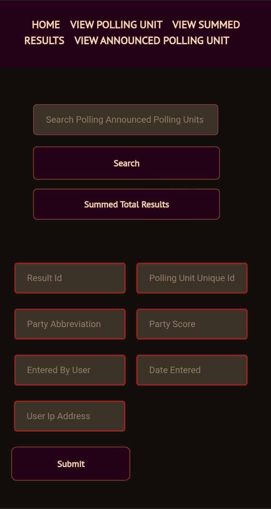
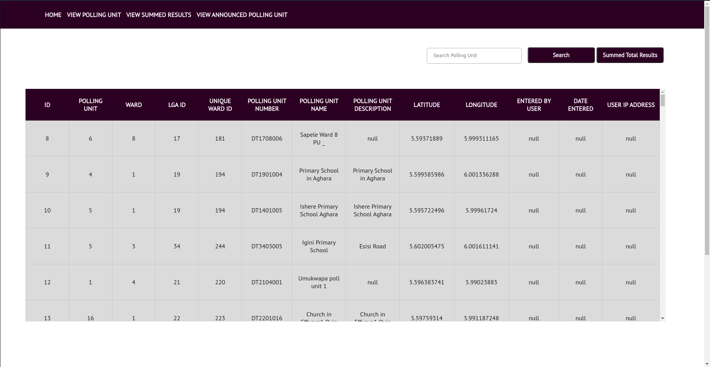
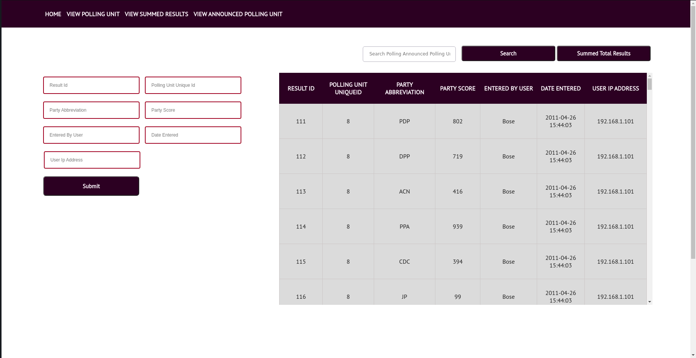

<h2> <b> GOVERNMENT POLLING UNIT ANALYSIS </b> </h2> 

<p>
This is a program that displays polling units from  INEC  for Wards under LGA, and states. <br>


 

 <br> <br>

 </br>
 </br>

</b>

</p>

<h3>  Description  </h3> </br>

* The central idea of this project is that given all the individual results announced in the polling units under any local government area, the user should be able to get an estimated result for that local government area. This can then be cross-checked with the result announced at the local government level. 

* The table  Polling Units  contains a list of poling units each has a ward of ID ,  Local Government Area , and  State ID. 

* The table ward contains a list of wards, while the local government contains a list of local government area. 

* Result from each polling unit is stored on about 9 rows with the score from each party being individual rows. 

* i). For the polling units with the uniqueid of 8, we have the results as follows 

<br> 

* <b> PDP: </b> 802  <br> 
* <b> DPP: </b> 719  <br> 
* <b> ACN: </b> 416  <br> 
* <b> PPA: </b> 939  <br> 
* <b> CDC: </b> 394  <br> 

<b> Polling unit </b> uniqueid and <b> Announced polling unit results </b> are two different rows. 

<br> 

<h3> <b> Dependencies </b> </h3>
<p> 
<ul>
<li> For this program to function, the required dependencies are needed. </li> <br> 
<li> <b> gunicorn </b> </li>
<li> <b> flask </b> </li>
<li> <b> sqlite3 </b> </li> 
</ul>

</p>

<h3> <b> Installing </b> </h3> 
<p>
<ul>
<li> Clone the repository into your local working directory, open a command line interface terminal on <b> Linux </b> or cmd on <b> Windows </b>, and type the command below.

</li> <br>
 
```
$ pip install -r requirements.txt 
```

<li> 
After installation, execute the <b> app.py </b>, or the <b> main.py </b> script to run the program. <br> 

```
$ python3 app.py 
```

```
$ python3 main.py 
```

</li>
</ul
</p>

<h3> <b> Authors </b> <h3> 
<li> Mbonu Chinedum Endurance </li> <br> 

<h3> <b> Version History </b> </h3>  
<li> Version <b> 1.0.0 </b> </li> <br> 

<h3> <b> License </b> </h3> 
<li> <b> INEC </b> License </li> 
<li> <b> MIT </b> License </li> <br>

<h3> <b> Acknowledgments </b> </h3> 
<li> To God Almighty </li> <br> 


